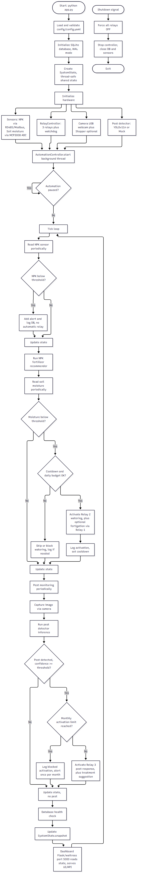
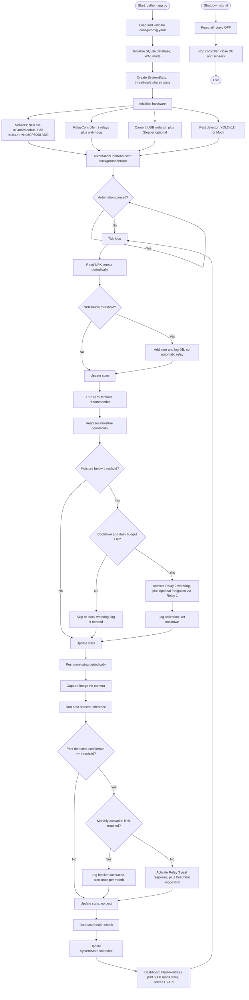

# VeggieCare — System Flowchart

High-level flowchart of the VeggieCare smart plant monitoring and control system,
suitable for inclusion in a thesis.

```mermaid
flowchart TD
    START([Start: python app.py]) --> CFG[Load and validate config/config.yaml]
    CFG --> DB[Initialize SQLite database, WAL mode]
    DB --> STATE[Create SystemState, thread-safe shared state]
    STATE --> HW[Initialize hardware]
    HW --> SENS[Sensors: NPK via RS485/Modbus, Soil moisture via MCP3008 ADC]
    HW --> REL[RelayController: 3 relays plus watchdog]
    HW --> CAM[Camera USB webcam plus Stepper optional]
    HW --> DET[Pest detector: YOLOv11n or Mock]
    SENS & REL & CAM & DET --> CTRL[AutomationController.start background thread]
    CTRL --> LOOP{Automation paused?}
    LOOP -- Yes --> LOOP
    LOOP -- No --> TICK[Tick loop]

    TICK --> NPK[Read NPK sensor periodically]
    NPK --> NPKC{NPK below threshold?}
    NPKC -- Yes --> NPKA[Add alert and log DB, no automatic relay]
    NPKC -- No --> NPKU[Update state]
    NPKA --> NPKU
    NPKU --> REC[Run NPK fertilizer recommender]
    REC --> MOIST[Read soil moisture periodically]
    MOIST --> MOISTC{Moisture below threshold?}
    MOISTC -- No --> MOISTU[Update state]
    MOISTC -- Yes --> GUARD{Cooldown and daily budget OK?}
    GUARD -- No --> MOISTB[Skip or block watering, log if needed]
    GUARD -- Yes --> WATER[Activate Relay 2 watering, plus optional fertigation via Relay 1]
    WATER --> WATERL[Log activation, set cooldown]
    MOISTB --> MOISTU
    WATERL --> MOISTU
    MOISTU --> PEST[Pest monitoring periodically]
    PEST --> CAP[Capture image via camera]
    CAP --> DETECT[Run pest detector inference]
    DETECT --> PESTC{Pest detected, confidence >= threshold?}
    PESTC -- No --> PESTU[Update state, no pest]
    PESTC -- Yes --> LIMIT{Monthly activation limit reached?}
    LIMIT -- Yes --> PESTB[Log blocked activation, alert once per month]
    LIMIT -- No --> PESTA[Activate Relay 3 pest response, plus treatment suggestion]
    PESTB --> PESTU
    PESTA --> PESTU
    PESTU --> HEALTH[Database health check]
    HEALTH --> SNAP[Update SystemState.snapshot]
    SNAP --> DASH[Dashboard Flask/waitress port 5000 reads state, serves UI/API]
    DASH --> TICK

    SHUT([Shutdown signal]) --> OFF[Force all relays OFF]
    OFF --> CLEAN[Stop controller, close DB and sensors]
    CLEAN --> EXIT([Exit])
```